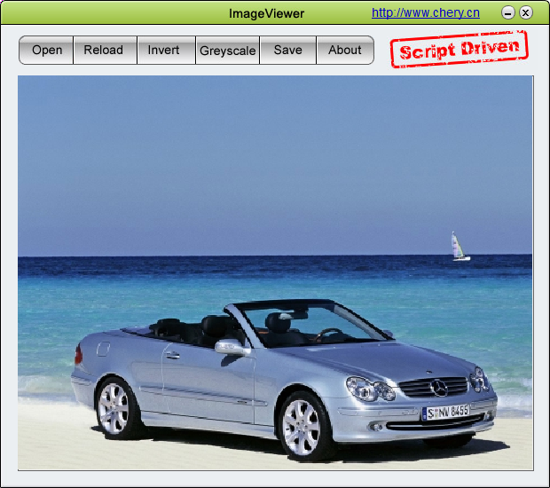
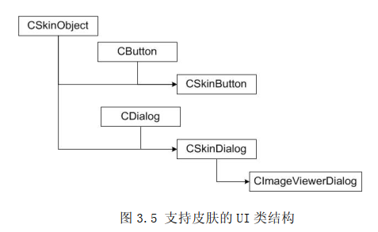
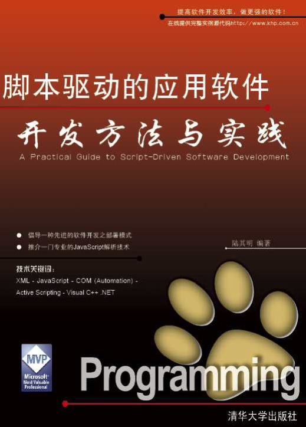

##### 《脚本驱动的应用软件开发方法与实践》 作者：陆其明

##### 说明

代码写得非常好，思路非常清楚，特地fork一份。

工程升级到VS2008

##### 作者blog

作者blog: [happydeer]
(https://blog.csdn.net/happydeer/article/details/756916)

##### 知识点

1、通过 C++编码来实现XML的解析。[CXmlWrapper](./ImageViewer_Skinned/CXmlWrapper.cpp)

2、通过xml设计软件界面，类似[duilib](https://github.com/duilib/duilib)。 [myViewer.xml](./ImageViewer_Skinned/Skin/myViewer.xml)

3、作者实现的[Skinned UI](./ImageViewer_Skinned/CSkinObject.h)。
 [CUISkinXmlParser.cpp](./ImageViewer_Skinned/CUISkinXmlParser.cpp)解析xml，生成界面控件。

##### 例子

1.3.3 实例程序：[ImageViewer_Basic](./ImageViewer_Basic) 传统的MFC控件程序

2.3.2.4 实例程序：[XMLParser](./XML/XMLParser) 利用微软的“Microsoft.XMLDOM”组件解析xml文件

3.3 实例程序：[ImageViewer_Skinned](./ImageViewer_Skinned) 解析XML生成C++界面

4.2 示例程序：[ImageViewer_Customized](./ImageViewer_Customized) 解析XML生成C++界面

5.2.2 自动化对象实现 [Automation](./Automation) 基于COM实现的自动化接口IDispatch

5.2.3 实例程序：[CurveSee](./CurveSee) 使用js引擎计算表达式并绘图

5.3 JavaScript 解析要点 [JSInterpreting](./JSInterpreting) JavaScript 解析的各个要点的演示

6.3 示例程序：[ImageViewer_ScriptDriver](./ImageViewer_ScriptDriven) js代码中调用C++方法，操作C++界面

#####  电子书下载

[eScriptDrivenAppDev.pdf](./eScriptDrivenAppDev.pdf)

http://read.pudn.com/downloads84/ebook/322385/eScriptDrivenAppDev.pdf

######  附件 Readme.txt

[Readme.txt](Readme.txt)

##### 其他

这本书是2005年写的，现在已经不流行使用js或者vb。现在可以使用lua脚本替换，简单又方便。

